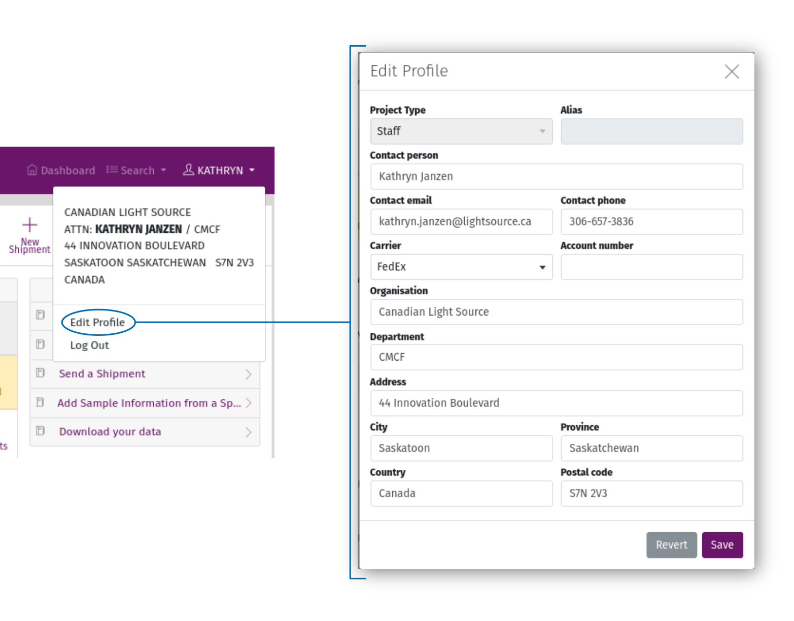

On the Dashboard
================

    Screenshot of the MxLIVE Dashboard

Menu
----
The menu bar is available throughout the MxLIVE interface, providing quick access:

  - back to your dashboard,
  - to detailed lists of all Shipments, Containers, Groups, Samples, Datasets, Reports, Sessions, and Activity in your account,
  - to view or edit your profile information.

My Profile
**********

The "My Profile" page displays the contact information we have for your account. You can edit your profile to update
this information at any time. For beamlines providing SSH access for file transfer, you can also add your public SSH key
from the profile page to simplify and secure access to data servers.

    View or Edit Your Profile Information

Indicate your preferences for communication and shipping by keeping your profile up-to-date.

  - **Contact person**: The preferred primary contact for your group. They may be contacted about shipping, samples, and
    beamtime (training requirements, team members, scheduling, etc).

    - **Contact email** Used along with the Principal Investigator's email address (uneditable) for notifications about
      upcoming beamtime.
    - **Contact phone** should be in the format [+9-]999-999-9999[ x9999]
  - **Carrier** and **Account Number** refer to your preferred shipping carrier and the applicable account number to be
    used for returning samples to your group following your completed beamtime.
  - The address entered is used for shipping labels and determining timezones.

.. note:: Some fields are only editable by staff.

    - **Project Type**: Used for beamline statistics.
    - **Alias**: An alternate display name to be used where the beamline schedule is made public. Primarily used for
      industrial clients or other users who require extra confidentiality.

My Stats
********
View your history at the beamline through numbers. Your usage statistics contain bulk information about shipments and
samples you have sent, data you have collected and analyzed, and time you have spent using the beamline.

.. image:: images/usage-stats.png
    :align: center
    :alt: Usage Statistics

Detailed Lists
**************

    Detailed lists of Shipments, Containers, Groups, Samples, Datasets, Reports, Sessions, and Activity

Detailed lists give you access to a full record of your activity in MxLIVE. Even after dataset and report files have
been removed from beamline data storage (as storage limits require), meta-data remains in MxLIVE in perpetuity.

Each list has a set of filters available, along with a search box to quickly find what you are looking for.

Clicking on an entry in the list will either take you to a separate page or a modal window with more details.

.. note:: Your entries in MxLIVE are only accessible from your account and an administration account. The only exception
          is draft shipments, which are only accessible by you, and become visible to staff once they have been sent.

Toolbar
-------
.. note:: This area is used as a toolbar throughout MxLIVE.

Tools and links available from the dashboard toolbar:

  - New Shipment: open the shipment creation wizard
  - Sessions: go to a list of all past and current sessions
  - Usage Stats: go to a page of detailed statistics related to your account
  - Schedule: go to the full beamline schedule

Beamtime
--------
Upcoming beamtime is listed here, along with past beamtime completed in the last year. The info icon displays beamtime
information which may also be sent by email around one week before your beamtime.

.. image:: images/dashboard-beamtime.png
    :align: center
    :alt: Beamtime

Once the local contact for your beamtime has been assigned, you can click the support icon to find contact information.

Shipments
---------

Your draft shipments are listed here, along with shipments currently at the beamline, and past shipments returned in the
last year.

Sessions
--------

Up to seven of your most recent sessions (started within the last year) are listed here. For sessions less than a week
old, you can provide feedback to help improve the beamline experience. If you have not yet submitted feedback for a
session, a link to the feedback form appears to the left of the session on your dashboard.

Feedback
--------

Feedback can be provided for sessions less than one week old by accessing the User Experience Survey through the
feedback icon located either on the dashboard or the session page.

Guide
-----

Helpful information, including video tutorials, images, or special instructions are posted in the User Guide. Click to
expand the item and view an image or video.

