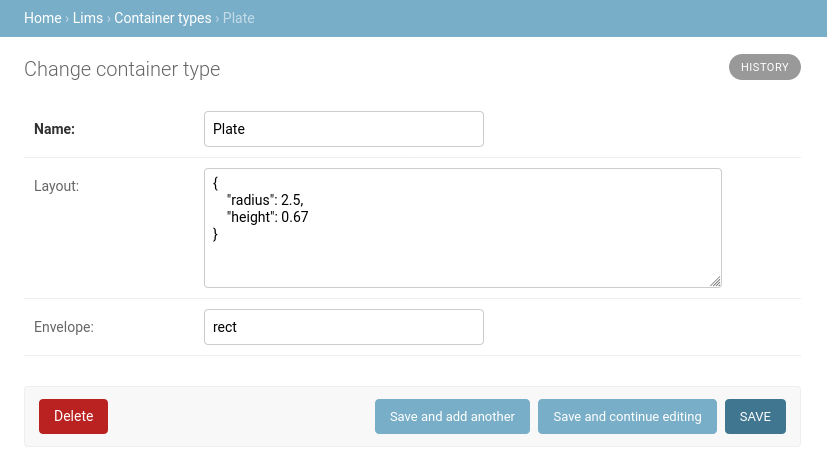

.. _new-layouts:

Container Types
===============
MxLIVE includes, by default, the following automounters and container types:

- **Automounters**:

    - **ISARA** accepts up to 29 Uni-Pucks
    - **SAM** accepts up to three Cassettes or Adaptors, which can accept up to four Uni-Pucks
    - **CATS** accepts up to nine Spine Pucks in main region and up to eight Plates in bottom row

.. image:: images/layout-automounters.png
   :align: center
   :alt: Automounter Layouts

- **Sample Holders**: Cane, Uni-Puck, SSRL Cassette, Spine Puck, Plate

.. image:: images/layout-containers.png
   :align: center
   :alt: Container Layouts

Creating New Container Types
----------------------------
To add a new automounter or sample holder, create a new Container Type entry from the MxLIVE Django administration site.
The **Envelope** can be ``rect`` or ``circle`` and is used to represent the shape of the container layout. The **Layout** is
a JSON dictionary providing a radius for circles representing locations in the container, and a height to define the
aspect ratio of rectangular envelopes, assuming a width of 1.

A Container Location should be created for every location in the new container type. The name should be kept to a few
characters. If this container type is meant to hold other container types, select the types of containers accepted at
this location. If this container is a sample holder, do not select any accepted containers.

.. image:: images/container-location.png
   :align: center
   :alt: Container Location

To display the container layout, choose the container type, and assign **x** and **y** coordinates. For rectangular
envelopes, x and y should be between 0 and 1, with (0, 0) being the top left corner, and (1, 1) the bottom right. If the
container type has a circular envelope, treat x and y as polar coordinates, radius r (between 0 and 1) and angle
:math:`{\theta}` (between :math:`{\pi}` and :math:`{-\pi}`) respectively.