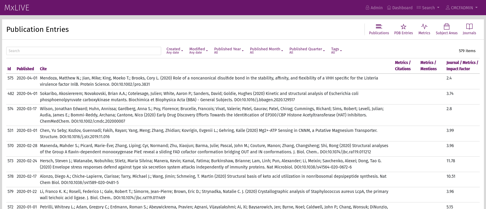
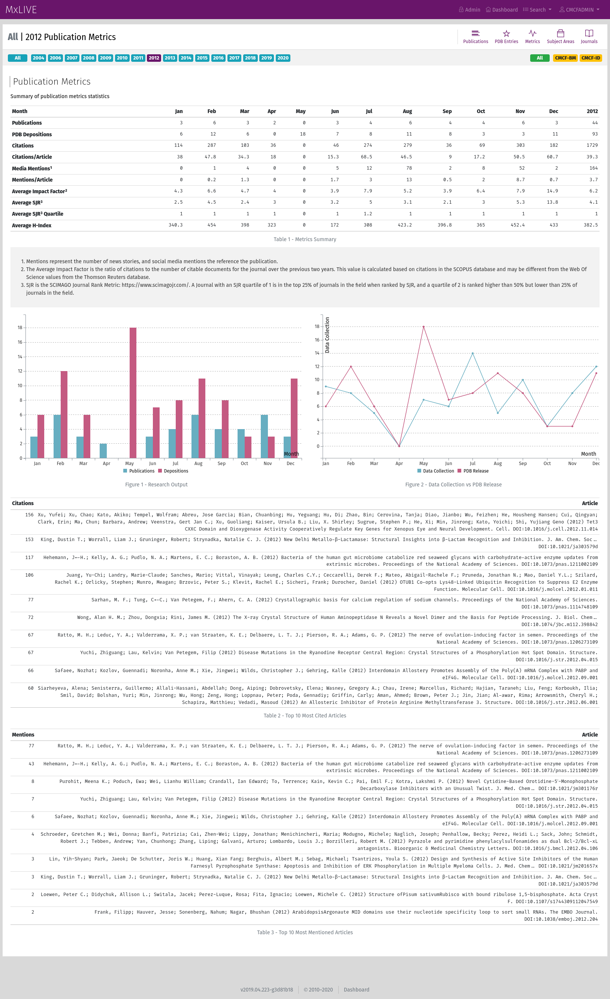

Publications
============

Publications in MxLIVE are fetched automatically. There is no mechanism for manually adding depositions or articles at
this time.

PDB depositions are fetched periodically from the RCSB (https://www.rcsb.org/pdb/rest/search, by default). New
depositions are added to MxLIVE, along with any associated articles.

Journal metrics are fetched from https://www.scimagojr.com/journalrank.php and stored by year.

Icons in the toolbar give access to:

  - detailed list of PDBs, Subject Areas, and Journals, and
  - publications metrics (statistics).

Statistics
^^^^^^^^^^
Publications metrics can be filtered by year and beamline.

