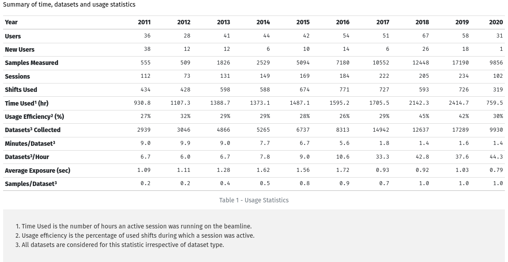
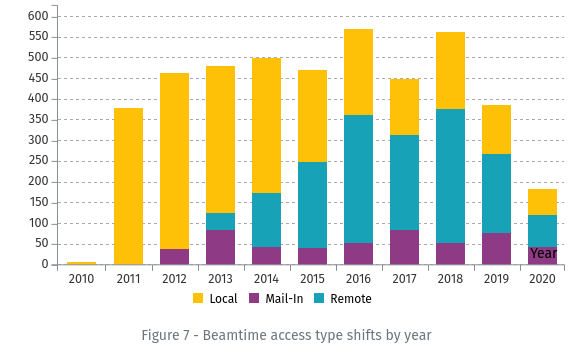
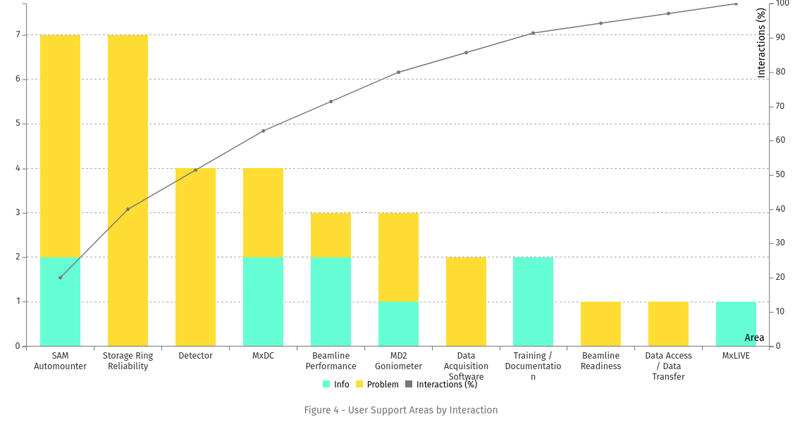
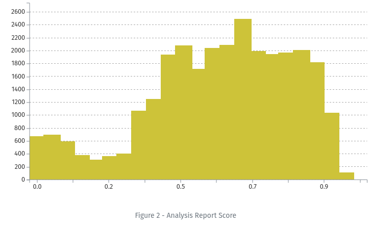
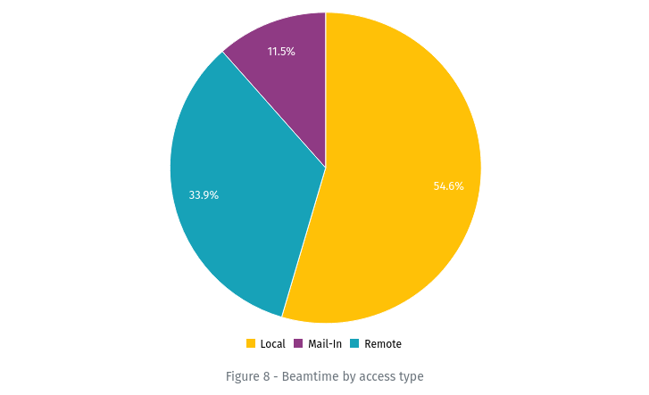
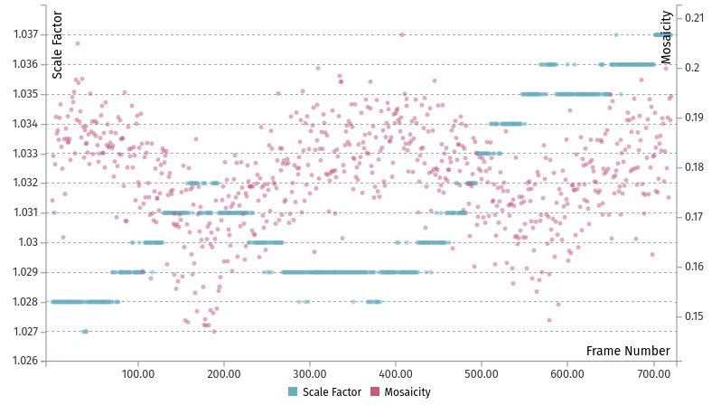
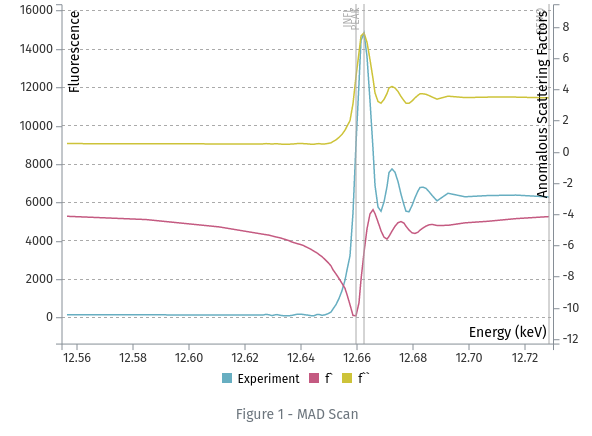
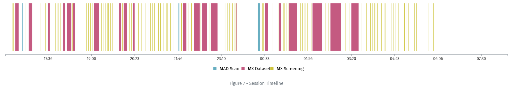

.. _formatting-reports:

Formatting Reports
==================
Analysis Reports are built dynamically based on information in the `details` JSONField, which is stored as a list of dictionaries.

Each dictionary in the list is treated as a Section in the report, with optional parameters. Sections are displayed in
order, and can be provided with a title, description (to go below the title), a list of dictionaries containing the
content (tables and/or plots) to display in the section, and notes to go after the content.

.. note:: The original version of MxLIVE reports is documented in :doc:`reportsv1`.

Section Options
---------------
.. code-block:: html

    'title': '',
    'description': '',
    'notes': '',
    'style': '',        # CSS class to be applied to the section
    'content': []       # list of dictionaries, each one describing a table or plot to display

Content Options
---------------
.. code-block:: html

    'title': '',
    'description': '',
    'notes': '',
    'style': '',        # CSS class to be applied to the content
    'kind': ,           # Supported types are 'barchart', 'columnchart', 'histogram', 'pie', 'scatterplot', 'lineplot', 'timeline'
    'header': 'row',    # For tables only. Options are 'row', 'column', or 'column row'
    'data':             # {} for plots / [] for tables

See sample tables, plots, and charts for detailed options. In general, colour definitions are optional.

.. contents:: Sample Report Items
    :depth: 2
    :local:

Tables
^^^^^^
.. code-block:: html

    {
        "title": "Metrics Overview",
        "style": "row",
        "content": [
        {
            "title": "Usage Statistics",
            "kind": "table",
            "data": [["Year", 2011, 2012, 2013, 2014, 2015, 2016, 2017, 2018, 2019, 2020],
                     ["Users", 36, 28, 41, 44, 42, 54, 51, 67, 58, 31],
                     ["New Users", 38, 12, 12, 6, 10, 14, 6, 26, 18, 1],
                     ["Samples Measured", 555, 509, 1826, 2529, 5094, 7180, 10552, 12448, 17190, 9856],
                     ["Sessions", 112, 73, 131, 149, 169, 184, 222, 205, 234, 102],
                     ["Shifts Used", 434, 428, 598, 588, 674, 771, 727, 593, 726, 319],
                     ["Usage Efficiency\u00b2 (%)", "27%", "32%", "29%", "29%", "28%", "26%", "29%", "45%", "42%", "30%"],
                     ["Datasets\u00b3 Collected", 2939, 3046, 4866, 5265, 6737, 8313, 14942, 12637, 17289, 9930],
                     ["Minutes/Dataset\u00b3", "9.0", "9.9", "9.0", "7.7", "6.7", "5.6", "1.8", "1.4", "1.6", "1.4"],
                     ["Datasets\u00b3/Hour", "6.7", "6.0", "6.7", "7.8", "9.0", "10.6", "33.3", "42.8", "37.6", "44.3"],
                     ["Average Exposure (sec)", "1.09", "1.11", "1.28", "1.62", "1.56", "1.72", "0.93", "0.92", "1.03", "0.79"],
                     ["Samples/Dataset\u00b3", "0.2", "0.2", "0.4", "0.5", "0.8", "0.9", "0.7", "1.0", "1.0", "1.0"]],
            "style": "col-12",
            "header": "column row",
            "description": "Summary of time, datasets and usage statistics",
            "notes": " 1. Time Used is the number of hours an active session was running on the beamline.  \n
                       2. Usage efficiency is the percentage of used shifts during which a session was active.  \n
                       3. All datasets are considered for this statistic irrespective of dataset type."
        },
    }

Column Charts
^^^^^^^^^^^^^
Example 1: Stacked Column Chart

.. code-block:: html

    {
        "title": "Beamtime access type shifts by year",
        "kind": "columnchart",
        "data": {
            "x-label": "Year",
            "stack": [["Local", "Mail-In", "Remote"]],
            "data": [
                {"Year": 2010, "Local": 8.0, "Mail-In": 0, "Remote": 0},
                {"Year": 2011, "Local": 380.0, "Mail-In": 0, "Remote": 0},
                ...,
                {"Year": 2019, "Remote": 192.0, "Mail-In": 76.0, "Local": 119.0},
                {"Year": 2020, "Local": 63.0, "Mail-In": 42.0, "Remote": 79.0}
            ],
            "colors": {"Local": "#FFC107", "Mail-In": "#8F3A84", "Remote": "#17A2B8"}
        },
        "style": "col-12 col-md-6"
    }

Example 2: Pareto Chart

.. code-block:: html

    {
        'title': 'User Support Areas by Interaction',
        'kind': 'columnchart',
        'data': {
            'aspect-ratio': 2,
            'colors': {"Info": '#66ffd5', "Lost Time (hours)": '#ffa333', "Problem": '#ffdd33', "Interactions (%)": '#777777'},
            'x-label': "Area",
            'line-limits': [0, 100],
            'line': "Interactions (%)",
            'stack': [["Info", "Problem"]],
            'data': [
                {'Area': 'SAM Automounter', 'Info': 2, 'Problem': 5, 'Interactions (%)': 20.0},
                ...,
                {'Area': 'MxLIVE', 'Info': 1, 'Problem': 0, 'Interactions (%)': 100.0}
            ]
        },
        'style': 'col-12 col-xl-6'
    }

Bar Charts
^^^^^^^^^^
A bar chart is essentially a Column Chart with horizontal bars. All options available for Column Charts are also
available for Bar Charts.

.. code-block:: html

    {
        "title": "Datasets",
        "kind": "barchart",
        "data": {
            "x-label": "User",
            "aspect-ratio": 0.7,
            "color-by": "Type",
            "colors": {"Student": "#073B4C", "Staff": "#06D6A0", "Industry": "#FFD166", "Commissioning": "#EF476F", "Academic": "#118AB2"},
            "data": [
                {"User": "someone", "Datasets": 10303, "Type": "Academic"},
                ...
                {"User": "someone else", "Datasets": 553, "Type": "Staff"}
            ]
        },
        "notes": "Dataset counts include all types of datasets. Only the top 30 users by number of datasets are shown",
        "style": "col-12 col-md-4"
    }

.. image:: images/report-barchart.png
    :align: center
    :alt: Bar Chart

Histograms
^^^^^^^^^^
.. code-block:: html

    {
        "title": "Analysis Report Score",
        "kind": "histogram",
        "data": {
            "data": [
                {"x": 0.03152173913043478, "y": 677},
                {"x": 0.07456521739130434, "y": 701},
                .....
                {"x": 0.9354347826086957, "y": 113},
                {"x": 0.9784782608695652, "y": 0}
            ]
        },
        "style": "col-12"
    }

Pie Charts
^^^^^^^^^^
.. code-block:: html

    {
        "title": "Beamtime by access type",
        "kind": "pie",
        "data": {
            "colors": "Live16",
            "data": [
                {"label": "Local", "value": 2431.0, "color": "#FFC107"},
                {"label": "Mail-In", "value": 514.0, "color": "#8F3A84"},
                {"label": "Remote", "value": 1511.0, "color": "#17A2B8"}
            ]
        },
        "style": "col-12 col-md-6"
    }

Scatter Plots
^^^^^^^^^^^^^
.. code-block:: html

    {
        "kind": "scatterplot",
        "data": {
            "y1": [["Scale Factor", 1.028, 1.028, ..., 1.037, 1.037]],
            "x": ["Frame Number", 1, 2, ..., 719, 720],
            "y2": [["Mosaicity", 0.17342, 0.18236, ..., 0.18954, 0.19437]]
        },
        "style": "half-height"
    }

Line Plots
^^^^^^^^^^
.. code-block:: html

    {
        "title": "MAD Scan",
        "kind": "lineplot",
        "data": {
            "x": ["Energy (keV)", 12.5567, 12.5847, ..., 12.7167, 12.7287],
            "y1": [["Experiment", 154, 145, ..., 6386, 6290]],
            "y2": [["f`", -4.13, -4.34, ..., 3.51, 3.46]],
            "x-label": "Energy (keV)",
            "y1-label": "Fluorescence",
            "y2-label": "Anomalous Scattering Factors",
            "aspect-ratio": 1.5,
            "annotations": [
                {"value": 12.662700000000001, "text": "PEAK"},
                {"value": 12.6597, "text": "INFL"},
                {"value": 12.7287002, "text": "REMO"}
            ]
        },
        "id": "mad",
        "style": "col-12"
    }

Timelines
^^^^^^^^^
.. code-block:: html

    {
        "title": 'Session Timeline',
        'kind': 'timeline',
        'start': 1583360100000,
        'end': 1583418044000,
        'data': [
            {'type': 'MAD Scan', 'start': 1583362067000, 'end': 1583362117000, 'label': 'MAD Scan: 000000-1111'},
            ...,
            {'type': 'MX Screening', 'start': 1583389899000, 'end': 1583389905000, 'label': 'MX Screening: TEST-02-screen'},
            {'type': 'MX Dataset', 'start': 1583365013000, 'end': 1583365193000, 'label': 'MX Dataset: TEST-02'},
            ...,
            {'type': 'MX Dataset', 'start': 1583367894000, 'end': 1583368141000, 'label': 'MX Dataset: Sim-01'},
            {'type': 'MX Dataset', 'start': 1583386783000, 'end': 1583386807000, 'label': 'MX Dataset: Sim-02'}
        ],
        'style': 'col-12'
    }

