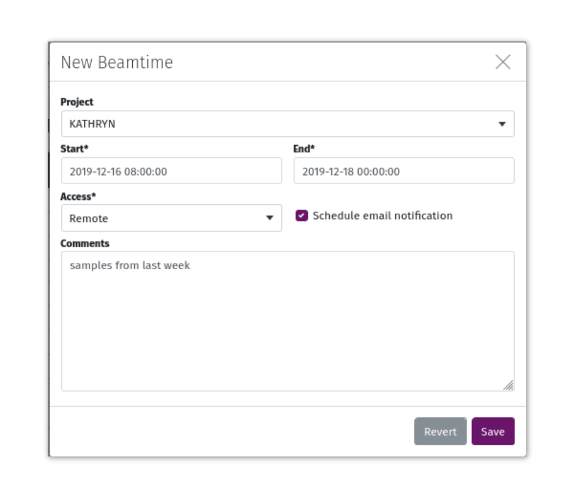

Scheduling
==========

To enable the optional scheduling app in MxLIVE, make sure the following line is included in your `settings.py` file::

    LIMS_USE_SCHEDULE = True

Facility modes are fetched on-the-fly from an API providing a JSON response. These modes are used for colour-coded
display on the MxLIVE schedule. Specify the location of the API in your `settings.py` file.::

    FACILITY_MODES = "https://external.site.com/api/schedule/modes/"

The response should be formatted in the following way, containing these fields at a minimum::

    [
        {
            "start": "2020-05-24T14:00:00Z",
            "end": "2020-05-25T06:00:00Z",
            "kind": "D",
        }, ...
    ]

The "kind" value for each mode is used as a CSS class which is used to display background colours on the schedule. The
colours by default are tailored to the modes provided by the USO at the Canadian Light Source.

.. image:: images/schedule-staff-labelled.png
   :align: center
   :alt: Staff Scheduling View

Access Types
^^^^^^^^^^^^
Access Types are defined through the Django administration site. The details provided in the form of Access Types
informs the colour codes assigned to beamtime, and the template used to generate email notifications. Access Types are
also used for beamline statistics.

.. image:: images/access-type.png
   :align: center
   :alt: Access Type

For custom emails, the **email subject** and **email body** are strings formatted with the following information:

  - ``{name}`` = The account's **Contact Person** or **First Name** **Last Name** (if no contact person is listed)
  - ``{beamline}`` = The scheduled beamline's acronym
  - ``{start_date}`` = The start date of the beamtime
  - ``{start_time}`` = The starting time of the first shift of the beamtime

Beamtime
^^^^^^^^
Beamtime is assigned to an account in MxLIVE. To schedule beamtime:

1. Select an unassigned shift as the first shift of the beamtime,
2. Select the final shift of the beamtime,
3. Complete and submit the form.

.. note:: If beamtime is scheduled during shifts that have already been assigned, the existing beamtime is either
          shortened to accommodate the new beamtime, or deleted completely if all shifts are being rescheduled.

Email Notifications
*******************
If **Schedule Email Notification** is selected, an email is scheduled for seven days prior to the start of the beamtime,
at 10am in the user's timezone (if the user's timezone cannot be determined based on the address in the account's
profile, the ``TIME_ZONE`` specified in the `settings.py` file is used). If seven days prior to the beamtime falls on a
weekend, the email is scheduled for the preceding Friday.

Emails are sent to the **Email Address** (only editable by staff) and the **Contact Email** (user-editable) for the
account. Click on the small "Mail" icon to the left of the scheduled beamtime to edit details about the notification,
including the scheduled delivery time, email subject, and message.

Downtime
^^^^^^^^
Downtime should be used to mark times when the beam was unexpectedly not available to users. The scope of the underlying
issue can be marked as "Facility" or "Beamline", with details included in the comments. Those comments are available in
the Beamtime Summary statistics.

To schedule Downtime, first toggle the switch marked "CANC" in the top-right corner of the weekly calendar. Then select
the first and last shift of the downtime, and complete the form.

.. image:: images/schedule-downtime.png
   :align: center
   :alt: Scheduling Downtime

User Support
^^^^^^^^^^^^
Click on an empty cell in the "Staff" column to assign beamline support. Any MxLIVE account specified with the Project Type
"Staff" can be scheduled for Beamline Support.

.. image:: images/schedule-support.png
   :align: center
   :alt: Scheduling User Support

Public Schedule
^^^^^^^^^^^^^^^
The schedule is available to all MxLIVE users through the dashboard of their account. To display the MxLIVE schedule on
a publicly visible website, insert the following HTML code::

    <iframe src="https://example.com/calendar/view" style="overflow: hidden; width: 100%;" scrolling="no" frameborder="0"></iframe>

.. raw:: html

    <iframe src="https://mxlive.lightsource.ca/calendar/view" style="overflow: hidden; width: 100%;" frameborder="0"></iframe>

By default, usernames of scheduled accounts are visible on the public schedule. If extra confidentiality is required,
the **alias** field in the user's profile should be used. If the alias has a value, only the alias is visible publicly.

Statistics
^^^^^^^^^^
Beamtime statistics are displayed side-by-side for multiple beamlines, and can be filtered by year.

.. image:: images/schedule-statistics.png
   :align: center
   :alt: Beamline Scheduling Statistics
