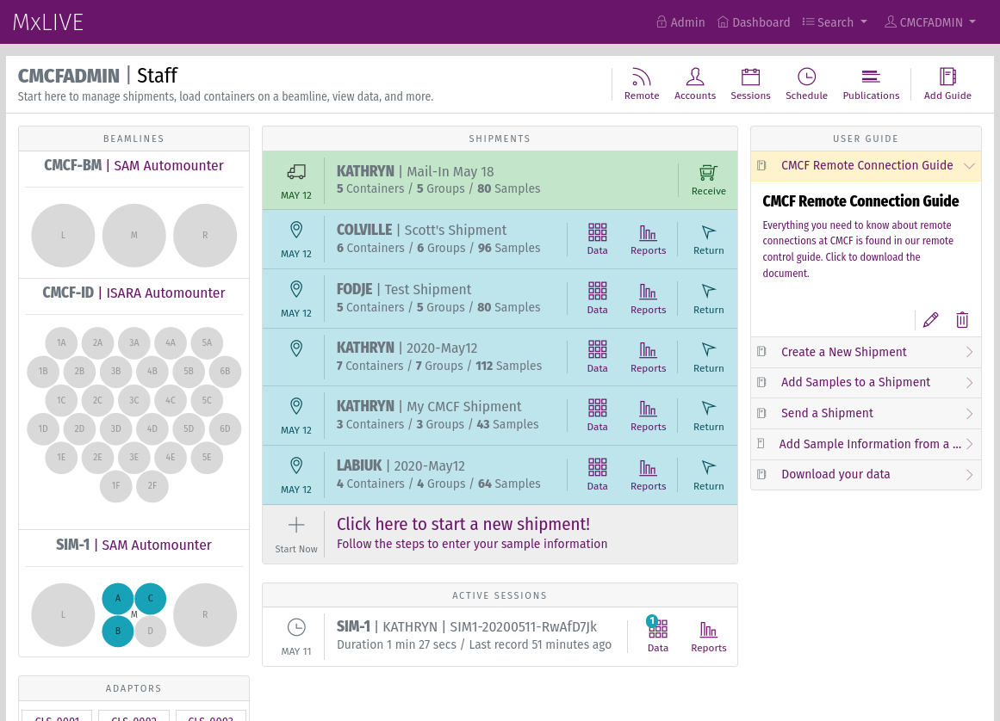
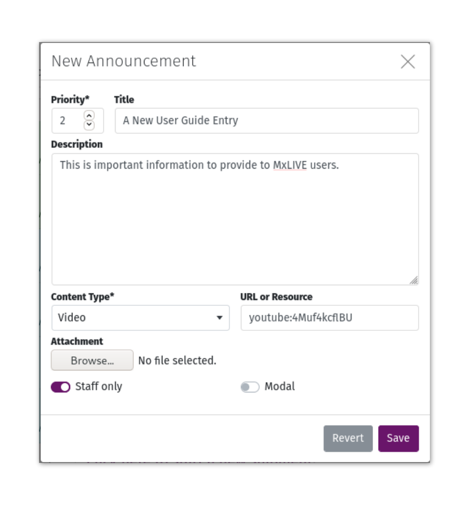
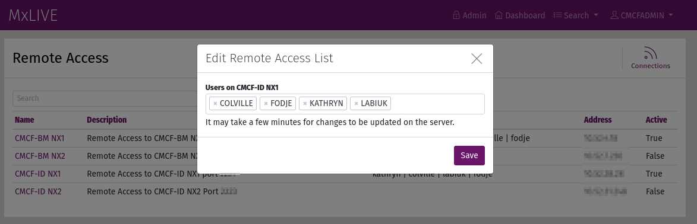
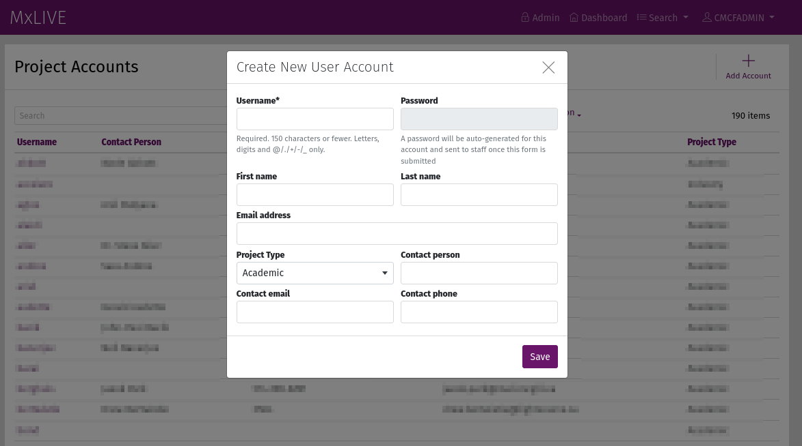
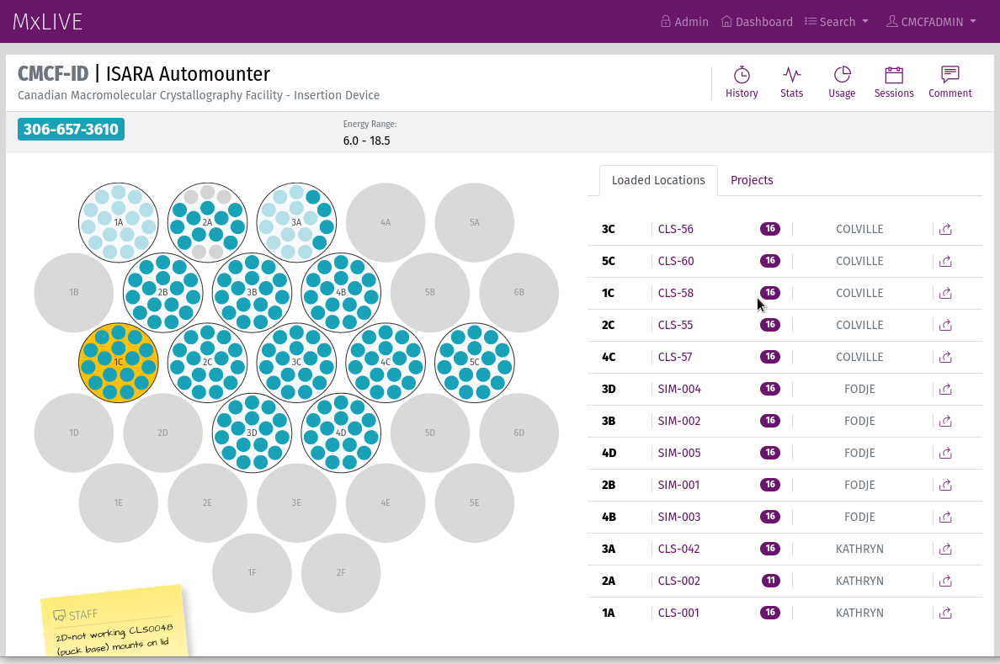
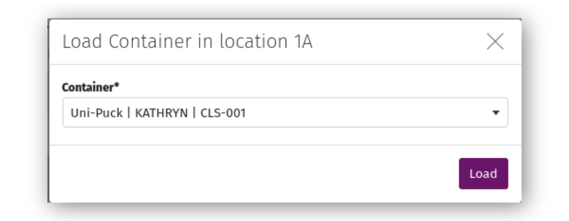
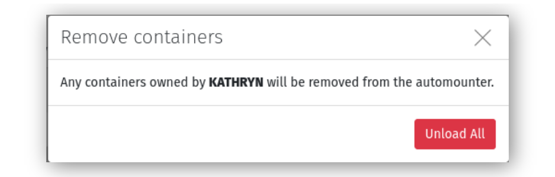

Staff Interface
===============

In this documentation "staff" refers to accounts marked as having superuser status in the Django administration site
(under Project Accounts). Staff are automatically directed to the staff dashboard upon logging in.  This is the hub
for all administrative tasks that are typically completed by beamline staff. MxLIVE is developed with the assumption
that there is only one staff account at any one time; however, multiple staff accounts are allowed. In the case that
there are multiple staff, the profile of the account that was created first will be referenced for shipping labels.

Dashboard
---------

    Screenshot of the MxLIVE Staff Dashboard

The staff dashboard has a similar layout to the user dashboard, with some notable differences.

- **Menu**: Provides access to the Django administration site
- **Profile**: The staff profile information is used as the beamline address for shipping labels provided to users.
- **Beamlines**: Staff have access to beamlines on the left side of the page.
- **Shipments**: All incoming (Sent) and On-site shipments are listed in this area. Sent shipments can be received
  directly from the dashboard with the "Receive" icon.
- **Sessions**: Active sessions are listed in this area. Active sessions are those where the user is currently running
  MxDC on the beamline.
- **Toolbar** provides access to:

    - Remote Connections
    - Accounts
    - Sessions Detailed List
    - Schedule
    - Publications
    - Add new User Guide entries

Guide
^^^^^
Create announcements that will be available on every user's dashboard, in the User Guide area. Assign priorities to your
announcements to control the order in which they are presented.

- Announcements marked "staff only" will only show up on the staff dashboard.
- To add a YouTube video, enter "youtube:{video_id}" as the URL or Resource.
- To add an image from Flickr, enter "flickr:{album}:{photo}" as the URL or Resource.

Remote Connections
------------------

Remote Connections in MxLIVE are tailored for managing NoMachine Server allowed user lists. Users who should be granted
access to NoMachine connections are added to the list of a specific remote connection, which they can then connect to
through the NoMachine Client. A python script `deploy/nxupdate.py` is set to run on each NoMachine Server periodically
to fetch the new user list from MxLIVE. A history of connection times and statuses is sent back to MxLIVE, and can be
viewed using the "Connections" icon in the toolbar.

Accounts
--------
When creating a new account, enter the **First Name**, **Last Name**, and **Email Address** of the owner of the account
(ie. the Principal Investigator, Project Leader, etc.). These fields are not editable by the user, but they are used,
along with the **Contact Email** (which IS editable by the user), for email notifications about upcoming beamtime.

The **Project Type** is used for calculating beamline statistics.

**Project Designations** can be used for any designation staff require. Once a Project Designation has been created
through the Django administration site, it will become available to select when editing a user's profile. As an example,
CMCF assigns a CRC designation to Canada Research Chairs, and a BeamTeam designation to Beam team members. Lists of
Accounts and Sessions can then be filtered by those designations when gathering statistics.

If a value is entered for the **Alias**, it is used as the display name on publicly visible schedules instead of the
account's username. This is to provide extra confidentiality to users for whom it is required, or to customize the
schedule display.

.. note:: Staff are able to see both the alias and the username on the staff schedule.

Detailed Lists
--------------
Staff detailed lists are similar to user detailed lists, but staff lists contain entries from all users. For this
reason, a column is prepended to staff lists containing the username of the owner of each item.

.. note:: Staff do not have access to any item in a Draft state (for example, shipments that have not yet been sent).

Beamlines and Automounters
--------------------------
Each beamline can be assigned an automounter layout for loading containers. Default autmounters included in MxLIVE are
SAM, CATS, and ISARA, but additional automounter layouts can be defined through the MxLIVE Django administration site.

To load a container in an automounter, select the location where the container will be loaded and choose from the list
of containers that are currently on-site and NOT loaded in an automounter.

To move a container to a different location in the same automounter, select the container from the layout and choose its
new location.

To unload a container, either select it from the layout and choose "Unload", or use the "Unload" icon in the right-hand
sidebar. You can also use the "Unload all" icon in the Projects tab to unload all containers belonging to a specific
user.

.. image:: images/staff-loaded-containers.png
    :align: left
    :alt: Unload All Containers for a User

