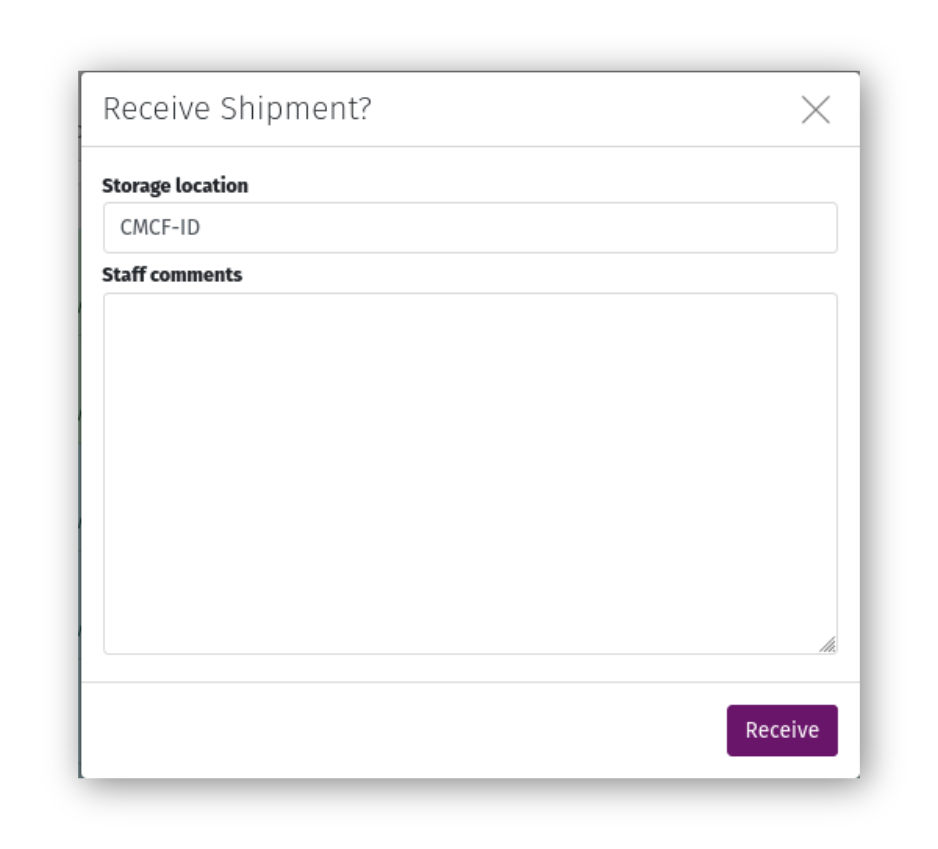
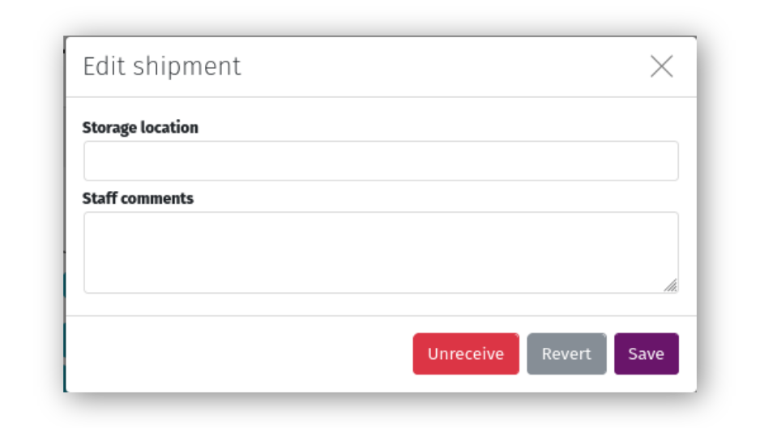
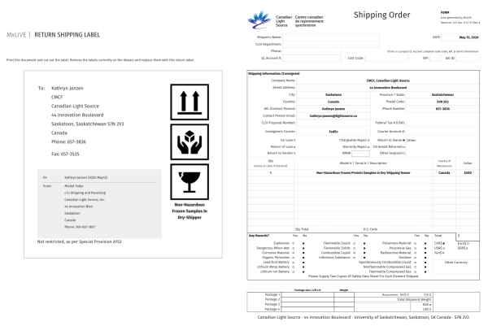
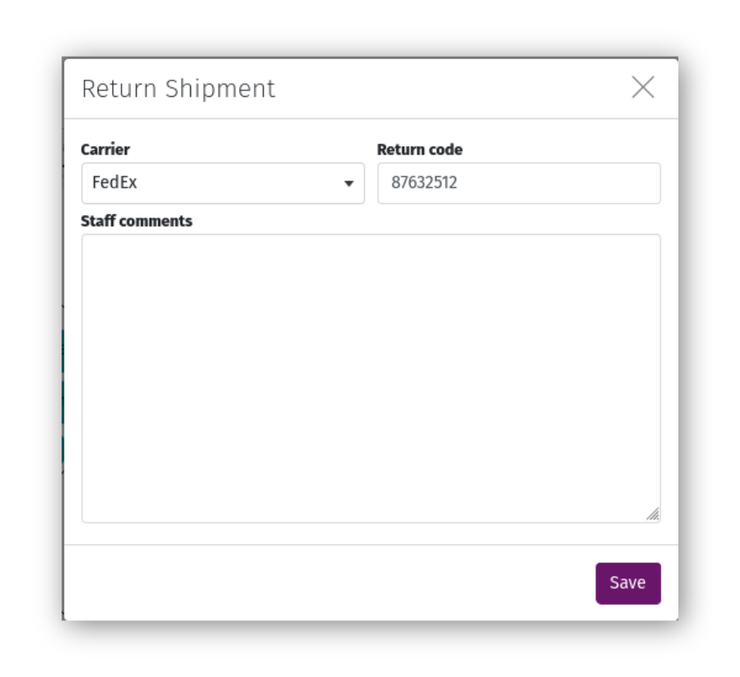

Managing Shipments
==================

Receive a Shipment
------------------
Once a user sends their shipment, it will be visible on your staff dashboard. When the shipment arrives on-site
physically, and has been received at the beamline, click the "Receive" icon and submit the form to mark it "On-site".
If you notice anything unusual about the shipment, you can leave comments in the form that will be visible to both staff
and the user.

Click the "Comments" icon on the shipment page toolbar to add or edit comments about the shipment. These comments are
visible to both staff and the user.

.. note:: If you marked a shipment "On-site" in error, or if the user needs to edit some information in the shipment
          (assuming no data has already been collected and associated with samples in the shipment), open the comments
          form and select "Unreceive". This will change the shipment's status to "Sent", and will allow the user to
          Recall their shipment, edit it, and Send it again.

Return a Shipment
-----------------
After a user's beamtime is complete and they are finished with their samples, print labels using the "Labels" icon in
the toolbar. Return labels include a label to affix to the outside of the transport container(s), and a shipping form to
be used by the facility Shipping & Receiving department. This form is customized for CLS Approved Document
0.11.1.19 Rev.6.

Click "Return" and complete the form to mark the shipment as returned. Returned shipments will not appear on the staff
dashboard, but are still available through detailed lists.

