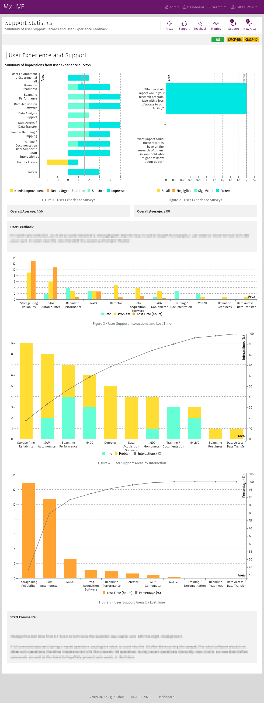

User Support and Feedback
=========================

User support interactions can be tracked through MxLIVE. Tools on the staff dashboard assist by pre-filling the support
record form based on the local contact assigned.

.. image:: images/support-record.png
   :align: center
   :alt: Support Record

Metrics are compiled automatically to show results of submitted user experience surveys, and user support trends.

